Green Buildings
===============

For this question, we will be checking our excel guru’s assumptions,
namely:    \* There is a “green premium” so that rent per square
foot is higher in green buildings   \* The premium remains constant
over 8 years (the ROI assuming a 90% occupancy rate)   \* Occupancy
rates are the same between green/normal buildings   \* Do electricity
costs remain constant across green/normal buildings  

I’ll start by ignoring the buildings with low occupancy rates (&lt;10%
occupied)

    library(tidyverse)
    greenbuildings <- read.csv('data/greenbuildings.csv', header=TRUE)
    greenbuildings <- na.omit(greenbuildings)
    greenbuildings <- greenbuildings %>% filter(leasing_rate>10)
    greenbuildings$green_rating <- as.factor(greenbuildings$green_rating)

 

How much is the green premium?
------------------------------

Does it remain constant within the first 10 years?
--------------------------------------------------

    df1 <- greenbuildings %>% filter(age<=10)
    ggplot(df1, aes(x=age,y=Rent,fill=green_rating)) + geom_bar(stat='identity', position=position_dodge(), width = 0.5)

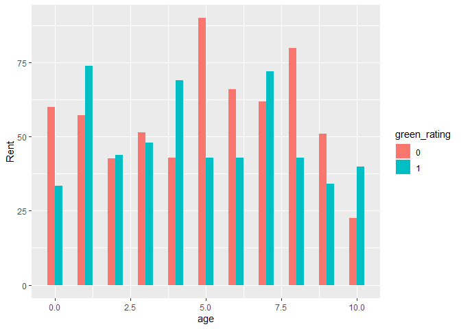

    green <- greenbuildings %>% filter(age<=10, green_rating == 1) %>% group_by(age) %>% summarize(avg=mean(Rent))

    normal <- greenbuildings %>% filter(age<=10, green_rating == 0) %>% group_by(age) %>% summarize(avg=mean(Rent))

    mean(green$avg-normal$avg)

    ## [1] -0.9830872

  It seems that there isn’t a green premium for newer buildings, and
green buildings actually recieve $-0.98 less rent on average.   \#\#
How does the occupancy rate change over time?

    df1 <- greenbuildings %>% filter(age<=10)
    ggplot(df1, aes(x=age,y=leasing_rate,fill=green_rating)) + geom_bar(stat='identity', position=position_dodge(), width = 0.5)

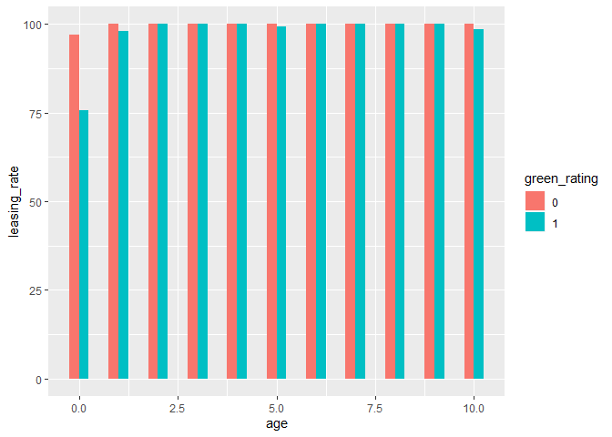
There is no visible difference in leasing rate, except for the first
year.  

Are there differences in electricty costs?  
-----------------------------------------------

One of the selling points of green buildings is that even though the
cost to build, the savings in electricity costs can partially cover the
additional initial investment. Even though the dataset doesn’t contain
electricy cost for individual buildings, we can still check this
assumption by checking if there is a higher percentage of green
buildings in regions with higher ‘degree days’.

    df1 = greenbuildings %>% filter(age<=10) %>% group_by(total_dd_07,green_rating) %>% 
                            summarize(n=n()) 
    df1$dd_quartile = ntile(df1$total_dd_07,4)
    ggplot(df1,aes(x=dd_quartile,y=n,fill=green_rating)) + geom_bar(position='fill', stat='identity')

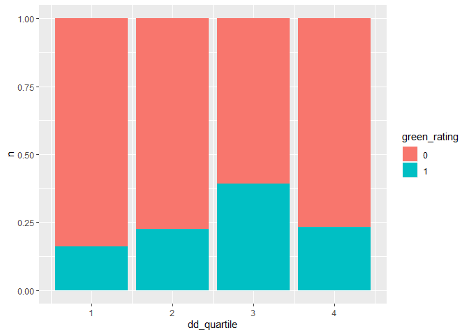
  It seems that the percentage of green buildings tend to increase
with the number of ‘degree days’, except for the highest quartile. Our
explanation is that there’s an incentive to go green because there are
some savings in electricity costs, as long as the weather isn’t too
extreme.     In conclusion, we disagree with the analysis done by
our Excel guru, because the green premium doesn’t exist for newer
buildigns, and the assumption that he made about the occupancy rate
doesn’t stand either. There is still an incentive to go green due to
electricity cost savings, but we believe that the magnitude is too small
to justify the initial investment in green certifications.    

Flights at ABIA
===============

For this question, we’ll start by looking at the data from a consumer’s
standpoint:   \* What are the distribution of delays by carrier, and
by month? \* Which destinations have the largest probability of delays?

    library(tidyverse)
    flights = read.csv('data/ABIA.csv',stringsAsFactors = FALSE)

    flights$Month <- as.factor(flights$Month)
    flights$DayofMonth <- as.factor(flights$DayofMonth)
    flights$DayOfWeek <- as.factor(flights$DayOfWeek)

We start by looking at the distribution of delays:

    ggplot(flights, aes(x=DepDelay)) + geom_histogram(binwidth=30)

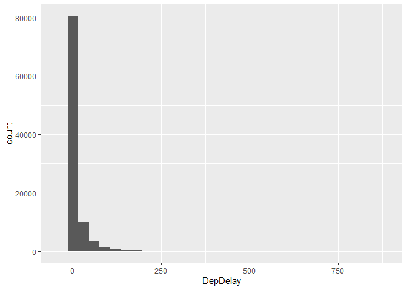

    ggplot(flights, aes(x=ArrDelay)) + geom_histogram(binwidth=30)

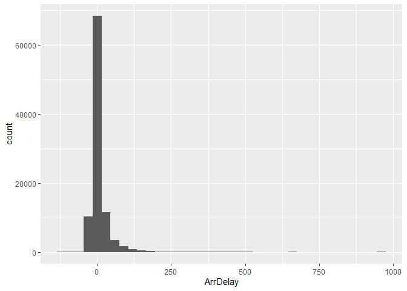
  Whether it is departure delays or arrival delays, planes usually
are within 10 minutes on schedule.   \#\# Which months are better for
traveling?

    dd_month = flights %>%
                      group_by(Month) %>%
                      summarise(mean_dd = mean(DepDelay,na.rm=TRUE),sd = sd(DepDelay,na.rm=TRUE)) %>%
                      arrange(desc(mean_dd))

    dd_month$Month <- factor(dd_month$Month, levels = dd_month$Month[order(-dd_month$mean_dd)])

    ggplot(dd_month, aes(x=Month, y=mean_dd)) + geom_bar(stat='identity') + 
          geom_errorbar(aes(ymin=mean_dd-sd,ymax=mean_dd+sd))

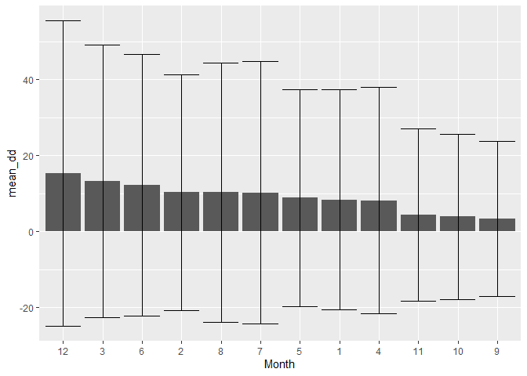
  Departures delays are worst during winter, spring, and summer
vacations, which makes sense because of the high amount of traffic
during these months. The spread of delays show similar patterns.  

Which carrier has the worst delays?
-----------------------------------

    flights <- flights %>%
            mutate(dep_type = ifelse(DepDelay < 10, "on time", "delayed"))

    ggplot(flights,aes(x=UniqueCarrier,y=DepDelay)) + geom_boxplot()

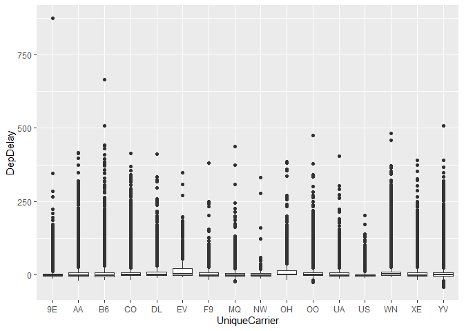

    ggplot(flights,aes(x=UniqueCarrier,y=DepDelay)) + geom_boxplot(outlier.shape = NA) + 
       coord_cartesian(ylim=c(-20,75))

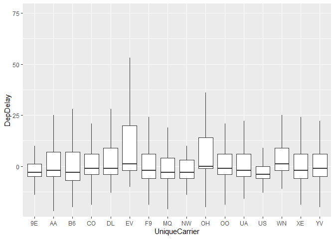
  Most delays are within the 1-hour mark, with a few exceptionally
long delays. We remove the extreme outliers because for those cases,
passengers should be able to transfer flights or request a refund. We
would avoid ExpressJet, Blue Streak, and SouthWest airlines.

Which destination has the most delays?
--------------------------------------

    flights <- flights %>%
            mutate(dep_type = ifelse(DepDelay < 10, "on time", "delayed"))

    df_delay <- flights %>%
            group_by(Dest) %>%
            summarise(ot_dep_rate = sum(dep_type == "on time") / n()) %>%
            drop_na() %>%
            arrange(desc(ot_dep_rate))

    ggplot(df_delay, aes(x=reorder(Dest,-ot_dep_rate), y=ot_dep_rate)) + geom_bar(stat='identity')

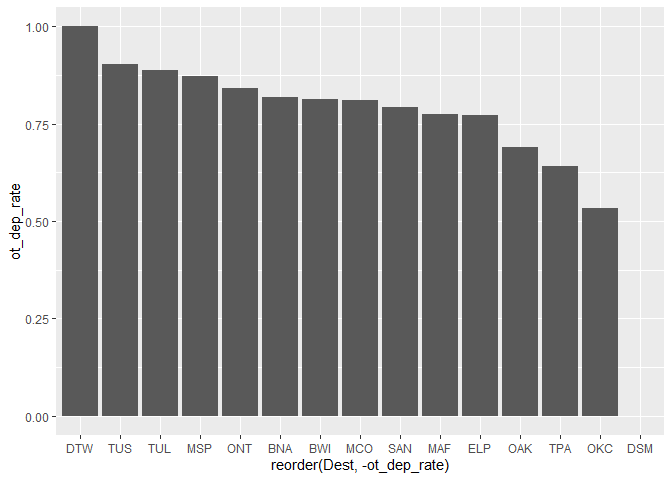
  Flights to Detroit, Tuscon, and Tulsa have the highest chance of
delays.  

Portfolio Modeling
==================

For this question, we will look at three portfolios:   1. Healthcare
/ Consumer goods = 3:2 allocation, industries that we feel are
relatively uneffected by the trade negotiations.   2. Full technology
allocation, industries that are in the spotlight because of the trade
negotiatons.   3. Biotechnology / Real estate / Business services =
2:2:1 allocation, our “momentum” portfolio because these industries have
outperformed the market for the past month.  

We view portfolios 1 & 2 as investments people will hold depending on
their outlooks of the trade negotiations, and portfolio 3 as the
holdings of someone who follows a momentum strategy.

  However, we will look at the historical standard deviations of the
portfolios to check their riskiness:  

    library(mosaic)
    library(foreach)
    library(quantmod)

Portfolio 1

    portfolio_1 = c("XLV","XBI","IBB","XRT","XLY")
    getSymbols(portfolio_1)

    ## [1] "XLV" "XBI" "IBB" "XRT" "XLY"

    for(ticker in portfolio_1) {
      expr = paste0(ticker, "a = adjustOHLC(", ticker, ")")
      eval(parse(text=expr))
    }

    p1_returns = cbind(ClCl(XLVa),ClCl(XBIa),ClCl(IBBa),ClCl(XRTa),ClCl(XLYa))
    p1_returns = as.matrix(na.omit(p1_returns))

Portfolio 2

    portfolio_2 = c("XLK","SMH","SOXX","IGV","VGT")
    getSymbols(portfolio_2)

    ## [1] "XLK"  "SMH"  "SOXX" "IGV"  "VGT"

    for(ticker in portfolio_2) {
      expr = paste0(ticker, "a = adjustOHLC(", ticker, ")")
      eval(parse(text=expr))
    }

    p2_returns = cbind(ClCl(XLKa),ClCl(SMHa),ClCl(SOXXa),ClCl(IGVa),ClCl(VGTa))
    p2_returns = as.matrix(na.omit(p2_returns))

Portfolio 3

    portfolio_3 = c("XLV","XBI","IYR","VNQ","PTF")
    getSymbols(portfolio_3)

    ## [1] "XLV" "XBI" "IYR" "VNQ" "PTF"

    for(ticker in portfolio_3) {
      expr = paste0(ticker, "a = adjustOHLC(", ticker, ")")
      eval(parse(text=expr))
    }

    p3_returns = cbind(ClCl(XLVa),ClCl(XBIa),ClCl(IYRa),ClCl(VNQa),ClCl(PTFa))
    p3_returns = as.matrix(na.omit(p3_returns))

  We will now calculate the VaR using bootstrapping methods.  

Portfolio 1 - Bearish view on trade negotiations
------------------------------------------------

    set.rseed(123)
    initial_wealth = 100000
    sim1 = foreach(i=1:5000, .combine='rbind') %do% {
      total_wealth = initial_wealth
      weights = c(0.2, 0.2, 0.2, 0.2, 0.2)
      holdings = weights * total_wealth
      n_days = 20
      wealthtracker = rep(0, n_days)
      for(today in 1:n_days) {
        return.today = resample(p1_returns, 1, orig.ids=FALSE)
        holdings = holdings + holdings*return.today
        total_wealth = sum(holdings)
        wealthtracker[today] = total_wealth
      }
      wealthtracker
    }
    return1 = mean(sim1[,n_days])
    hist(sim1[,n_days]- initial_wealth, breaks=30,main = "Histogram of Return for Portfolio 1",xlab = "Return")
    VaR1 = quantile(sim1[,n_days], 0.05) - initial_wealth
    abline(v=VaR1,col="red",lty=2)

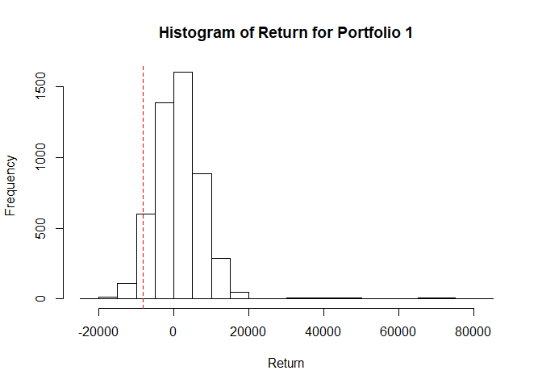
\#\# Portfolio 2 - Bullish view on trade negotiations

    set.rseed(123)
    initial_wealth = 100000
    sim2 = foreach(i=1:5000, .combine='rbind') %do% {
      total_wealth = initial_wealth
      weights = c(0.2, 0.2, 0.2, 0.2, 0.2)
      holdings = weights * total_wealth
      n_days = 20
      wealthtracker = rep(0, n_days)
      for(today in 1:n_days) {
        return.today = resample(p2_returns, 1, orig.ids=FALSE)
        holdings = holdings + holdings*return.today
        total_wealth = sum(holdings)
        wealthtracker[today] = total_wealth
      }
      wealthtracker
    }
    return2 = mean(sim2[,n_days])
    hist(sim2[,n_days]- initial_wealth, breaks=30,main = "Histogram of Return for Portfolio 1",xlab = "Return")
    VaR2 = quantile(sim2[,n_days], 0.05) - initial_wealth
    abline(v=VaR2,col="red",lty=2)

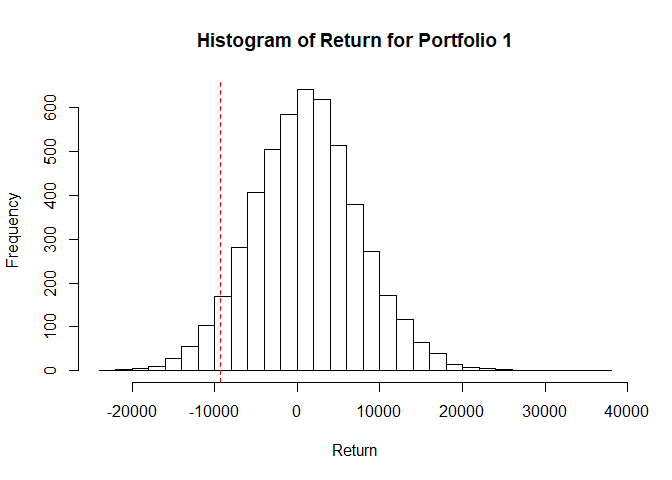

Portfolio 3 - Momentum investor
-------------------------------

    set.rseed(123)
    initial_wealth = 100000
    sim3 = foreach(i=1:5000, .combine='rbind') %do% {
      total_wealth = initial_wealth
      weights = c(0.2, 0.2, 0.2, 0.2, 0.2)
      holdings = weights * total_wealth
      n_days = 20
      wealthtracker = rep(0, n_days)
      for(today in 1:n_days) {
        return.today = resample(p3_returns, 1, orig.ids=FALSE)
        holdings = holdings + holdings*return.today
        total_wealth = sum(holdings)
        wealthtracker[today] = total_wealth
      }
      wealthtracker
    }
    return3 = mean(sim3[,n_days])
    hist(sim3[,n_days]- initial_wealth, breaks=30,main = "Histogram of Return for Portfolio 1",xlab = "Return")
    VaR3 = quantile(sim3[,n_days], 0.05) - initial_wealth
    abline(v=VaR3,col="red",lty=2)

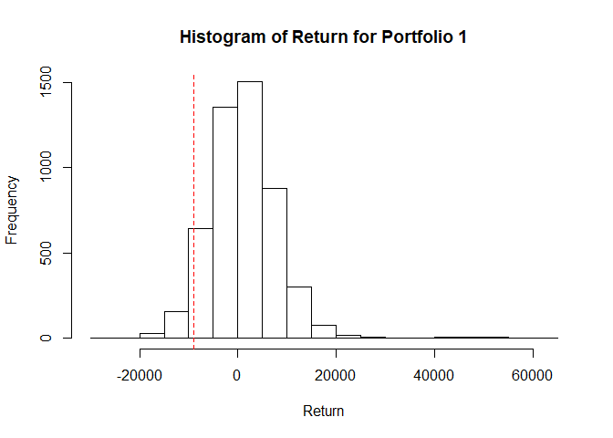
  We feel under current market conditions, calculating VaR with
bootstrapping should be better than using Z-scores, due to the amount of
market-moving news stories that are popping up every week, which causes
the normality assumptions to fail.   Also regarding the risks of our
portfolios:   Portfolio 1 risks 1 dollar to get 0.204 dollars 
Portfolio 2 risks 1 dollar to get 0.124 dollars  Portfolio 3 risks 1
dollar to get 0.146 dollars  If we were to enter a trading
competition today, we would probably be looking for an industry
allocation similar to portfolio 1.  

Market segmentation
===================

For this question, we’ll try to segment NutrientH20’s twitter followers
using PCA, and provide some online marketing suggestions.   First we
removed “chatter”, “uncategorized”, “adult”, and “spam” columns because
those variables do not provide additional insight in their current
state. We then calculate the frequency of topics for each twitter
follower.  

    library(ggplot2)
    social <- read.csv('data/social_marketing.csv', header=TRUE, row.names=1)
    social <- social[,-c(1,5,35,36)]
    social_freq = social/rowSums(social)

We decide to analyze the top 9 loadings, because together they explain
half of the total variance in our dataset.  

    pca = prcomp(social_freq, scale=TRUE)
    loadings = pca$rotation
    scores = pca$x
    s = summary(pca)
    plot(s$importance[3,],xlab='PC', ylab='Cumulative Proportion')

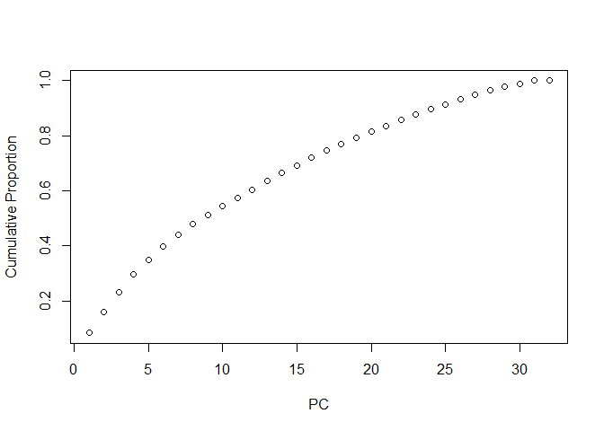

    for (i in 1:9) {
      expr = paste0("o",i," = order(loadings[,",i,"],decreasing=TRUE)")
      eval(parse(text=expr))
    }

    for (i in 1:9) {
      expr = paste0("colnames(social_freq)[head(o",i,",3)]")
      print(eval(parse(text=expr)))
    }

    ## [1] "sports_fandom" "religion"      "parenting"    
    ## [1] "health_nutrition" "personal_fitness" "outdoors"        
    ## [1] "fashion" "beauty"  "cooking"
    ## [1] "college_uni"    "online_gaming"  "sports_playing"
    ## [1] "shopping"       "photo_sharing"  "current_events"
    ## [1] "automotive"    "photo_sharing" "shopping"     
    ## [1] "automotive" "news"       "tv_film"   
    ## [1] "music"   "cooking" "food"   
    ## [1] "music"          "small_business" "business"

  We will now group by the top variable for each component, and list
our suggestions for marketing recommendations for each group:   \*
Group 1 - Parents: Sponsor children’s sports events   \* Group 2 -
Fitness freak: Bottle should fit easily in the side pockets of backpacks
  \* Group 3 - Beauty blogger: Focus on how water can make your skin
glow   \* Group 4 - College student: Offer bulk quanitity discounts
  \* Group 5 - Activist: Consider green packaging   \* Group 6 -
Car enthusiast: Give discounts to car dealers   \* Group 7 - Music
lover: Mention NutrientH20 isn’t a part of a large corporation    

Author attribution
==================

For this question, we will be predicting the author of an article based
on textual content,   we will be fitting three models:   \*
Logistic regression with lasso regulization   \* Random Forest  
\* Naive bayes     First we will read in the training data and
create a corpus

    library(tm) 
    library(magrittr)
    library(slam)
    library(proxy)
    library(glmnet)

    # Reader function that specifies English
    readerPlain = function(fname){
      readPlain(elem=list(content=readLines(fname)), 
                id=fname, language='en') }

    # Read the training data and create a corpus
    setwd("data/ReutersC50/C50train")
    doc_list = Sys.glob('*')
    file_list = Sys.glob(paste0(doc_list, '/*.txt'))

    # Clean up the filenames, 
    all_docs = lapply(file_list, readerPlain) 
    mynames = file_list %>%
    { strsplit(., '/', fixed=TRUE) } %>%
    { lapply(., tail, n=2) } %>%
    { lapply(., paste0, collapse = '') } %>%
      unlist

    names(all_docs) = mynames
    documents_raw = VCorpus(VectorSource(all_docs))

  Preprocess the data with the following steps:   1. Make
everything lowercase   2. Remove numbers   3. Remove punctuation
  4. Remove excess whitespace   5. Remove stopwords   6.
Combine stem words  

    my_documents = documents_raw
    my_documents = tm_map(my_documents, content_transformer(tolower)) 
    my_documents = tm_map(my_documents, content_transformer(removeNumbers)) 
    my_documents = tm_map(my_documents, content_transformer(removePunctuation)) 
    my_documents = tm_map(my_documents, content_transformer(stripWhitespace))
    my_documents = tm_map(my_documents, content_transformer(removeWords), stopwords("SMART")) ##
    my_documents = tm_map(my_documents, stemDocument)

  Now we convert the corpus into a document-term matrix(DTM),  and
then drop terms that have count 0 in less than 95% of documents.

    DTM = DocumentTermMatrix(my_documents)

    DTM = removeSparseTerms(DTM, 0.95)

    tfidf = weightTfIdf(DTM)

  Now we run PCA and pick the top 150 principal components, which
account for 50% of the total variance.

    #PCA on tfidf
    X = as.matrix(tfidf)
    pca= prcomp(X, scale=TRUE)
    summary(pca)$importance[3,]%>%plot()

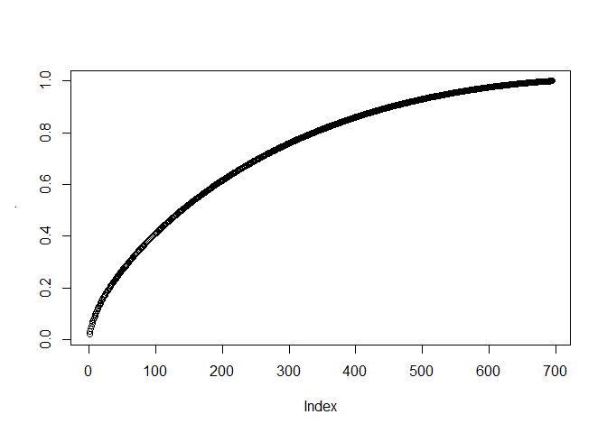

    #independent variables: X
    X = pca$x[,1:150]

    all  <- vector()
    i = 1
    for (auther in doc_list){
      all[i] = auther
      i = i+1
    }

    #Model dependent variable: Y
    Y = vector()
    for( i in 1:2500){
      Y[i] = all[ceiling(i/50)]
    }

  Now do the same transformations for the test set:

    readerPlain = function(fname){
      readPlain(elem=list(content=readLines(fname)), 
                id=fname, language='en') }
    setwd("data/ReutersC50/C50test")
    doc_list = Sys.glob('*')
    file_list = Sys.glob(paste0(doc_list, '/*.txt'))

    file_list = Sys.glob(paste0(doc_list, '/*.txt'))
    cp2 = lapply(file_list, readerPlain) 

    mynames = file_list %>%
    { strsplit(., '/', fixed=TRUE) } %>%
    { lapply(., tail, n=2) } %>%
    { lapply(., paste0, collapse = '') } %>%
      unlist
    names(cp2) = mynames

    documents_raw_1 = VCorpus(VectorSource(cp2))

    my_documents1 = documents_raw_1
    my_documents1 = tm_map(my_documents1, content_transformer(tolower))
    my_documents1 = tm_map(my_documents1, content_transformer(removeNumbers))
    my_documents1 = tm_map(my_documents1, content_transformer(removePunctuation)) 
    my_documents1 = tm_map(my_documents1, content_transformer(stripWhitespace)) 
    my_documents1 = tm_map(my_documents1, content_transformer(removeWords), stopwords("SMART"))
    my_documents1 = tm_map(my_documents1, stemDocument)

    DTM_test = DocumentTermMatrix(my_documents1,control = list(dictionary=Terms(DTM)))
    DTM_test = removeSparseTerms(DTM_test, 0.95)

    tfidf_test = weightTfIdf(DTM_test)

    X_test = as.matrix(tfidf_test)

  Some terms in the test set are not in the training set, we will be
ignoring these words.

    #Matching column names of test TFIDF to train TFIDF
    train_pre_pc = as.matrix(tfidf)

    train_name = colnames(train_pre_pc)
    test_name = colnames(X_test)
    sup = setdiff(train_name, test_name)

    temp_x = data.frame(X_test)
    for (colname_ in sup){
      temp_x[,colname_] = 0
    }

  Somehow “break.” doesn’t get its punctuation removed properly so we
will fix it manually.   Afterwards, we will transform the test set to
the PC spaces of the training set.

    #setdiff(colnames(t), train_name)

    colnames(temp_x)[colnames(temp_x)=="break."] <- "break"
    t = data.matrix(temp_x)
    t <- t[, order(colnames(t))]

    #transform the test set to the principal component spaces of the training set
    test.data <- predict(pca, newdata =t)
    test.data <- as.data.frame(test.data)
    test.data <- test.data[,1:150]

  First, we will try Logistic regression with lasso regulization:

    library(caret)

    ## Warning: package 'caret' was built under R version 3.6.1

    ## 
    ## Attaching package: 'caret'

    ## The following object is masked from 'package:mosaic':
    ## 
    ##     dotPlot

    ## The following object is masked from 'package:purrr':
    ## 
    ##     lift

    library(glmnet)
    #out1 = glmnet(X, factor(Y), family="multinomial")
    cv_lr = cv.glmnet(X, factor(Y), family="multinomial",alpha=1)
    p1 = predict(cv_lr, data.matrix(test.data), s="lambda.min", type = "response")

    myPredict_for_lr <- function(which_article){
      return(which.max(p1[which_article,,]))
    }

    Ya  <- vector()
    i = 1
    for (author in doc_list){
      Ya[i] = author
      i = i+1
    }

    #y_test are the true author names
    y_test = vector()
    for( i in 1:2500){
      y_test[i] = Ya[ceiling(i/50)]
    }

    #Predict and calculate accuracy
    lr_pred = vector()
    for (i in 1:2500){
      lr_pred[i] =names(myPredict_for_lr(i))
    }

    mean(lr_pred == factor(y_test))

    ## [1] 0.55

  Second, we will try random forest:

    library(randomForest)

    ## Warning: package 'randomForest' was built under R version 3.6.1

    ## randomForest 4.6-14

    ## Type rfNews() to see new features/changes/bug fixes.

    ## 
    ## Attaching package: 'randomForest'

    ## The following object is masked from 'package:dplyr':
    ## 
    ##     combine

    ## The following object is masked from 'package:ggplot2':
    ## 
    ##     margin

    fY = factor(Y)
    dfX =data.frame(X)
    XY = cbind(dfX, fY)

    rffit = randomForest(fY~.,data=XY,ntree=500)
    rf_pred = predict(rffit, newdata = test.data)
    mean(rf_pred == factor(y_test))

    ## [1] 0.5088

  Finally we try naive bayes:

    library(e1071)

    ## Warning: package 'e1071' was built under R version 3.6.1

    nb = naiveBayes(fY~.,data=XY)
    nb_pred = predict(nb, newdata = test.data)
    mean(nb_pred == factor(y_test))

    ## [1] 0.4204

  For our case, logistic regression with lasso regulation seems to
work best, which gives us 55% accuracy. Random forest works okay as a
baseline because it doesn’t require a lot of tuning (it gives 51%
accuracy), and naive bayes doesn’t work very well, which gives us 42%
accuracy, probably because Reuters is a business & finance news website,
and word choices in these articles may not be independant. However,
naive bayes could perform better then the other models as we approach
larger datasets and articles with more diverse topics, because of its
computational efficiency.  

Association rule mining
=======================

For this question, we will utilize association rule mining to provide
product placement / promotional discounts / and advertisement
suggestions for our mock grocery store.

    library(arules)

    ## Warning: package 'arules' was built under R version 3.6.1

    ## 
    ## Attaching package: 'arules'

    ## The following object is masked from 'package:tm':
    ## 
    ##     inspect

    ## The following objects are masked from 'package:mosaic':
    ## 
    ##     inspect, lhs, rhs

    ## The following object is masked from 'package:dplyr':
    ## 
    ##     recode

    ## The following objects are masked from 'package:base':
    ## 
    ##     abbreviate, write

    groceries = read.transactions("data/groceries.txt", format="basket", sep=",")
    summary(groceries)

    ## transactions as itemMatrix in sparse format with
    ##  9835 rows (elements/itemsets/transactions) and
    ##  169 columns (items) and a density of 0.02609146 
    ## 
    ## most frequent items:
    ##       whole milk other vegetables       rolls/buns             soda 
    ##             2513             1903             1809             1715 
    ##           yogurt          (Other) 
    ##             1372            34055 
    ## 
    ## element (itemset/transaction) length distribution:
    ## sizes
    ##    1    2    3    4    5    6    7    8    9   10   11   12   13   14   15 
    ## 2159 1643 1299 1005  855  645  545  438  350  246  182  117   78   77   55 
    ##   16   17   18   19   20   21   22   23   24   26   27   28   29   32 
    ##   46   29   14   14    9   11    4    6    1    1    1    1    3    1 
    ## 
    ##    Min. 1st Qu.  Median    Mean 3rd Qu.    Max. 
    ##   1.000   2.000   3.000   4.409   6.000  32.000 
    ## 
    ## includes extended item information - examples:
    ##             labels
    ## 1 abrasive cleaner
    ## 2 artif. sweetener
    ## 3   baby cosmetics

  The summary shows that our mock grocery stores is more likely a
7-11 than a Wallmart due to the high number of customers that buy 1-2
items.  

    itemFrequencyPlot(groceries, topN=15, type="absolute", main="Item Frequency")

  From the item frequency plot, our grocery store should be locaetd
near a residential area.

  We will explain the reasoning behind our thresholds:   \*
support: We will only consider patterns that appear in more than 0.5% of
our transactions   \* confidence: We will only consider transactions
where the right-hand side appears in more than 60% of transactions that
contains the items on the left-hand side.  \* maxlen: We choose
length 3 because transactions that contain 3 or less items already
account for more than 50% of all transactions. 

    groceries_trans <- as(groceries, "transactions")
    groceries_rules <- apriori(groceries_trans, parameter=list(support=.005, confidence=.60, maxlen=3))

    ## Apriori
    ## 
    ## Parameter specification:
    ##  confidence minval smax arem  aval originalSupport maxtime support minlen
    ##         0.6    0.1    1 none FALSE            TRUE       5   0.005      1
    ##  maxlen target   ext
    ##       3  rules FALSE
    ## 
    ## Algorithmic control:
    ##  filter tree heap memopt load sort verbose
    ##     0.1 TRUE TRUE  FALSE TRUE    2    TRUE
    ## 
    ## Absolute minimum support count: 49 
    ## 
    ## set item appearances ...[0 item(s)] done [0.00s].
    ## set transactions ...[169 item(s), 9835 transaction(s)] done [0.00s].
    ## sorting and recoding items ... [120 item(s)] done [0.00s].
    ## creating transaction tree ... done [0.00s].
    ## checking subsets of size 1 2 3

    ## Warning in apriori(groceries_trans, parameter = list(support = 0.005,
    ## confidence = 0.6, : Mining stopped (maxlen reached). Only patterns up to a
    ## length of 3 returned!

    ##  done [0.00s].
    ## writing ... [13 rule(s)] done [0.00s].
    ## creating S4 object  ... done [0.00s].

    rules_by_lift <- sort(groceries_rules, by = "lift")
    inspect(rules_by_lift)

    ##      lhs                               rhs                support    
    ## [1]  {pip fruit,whipped/sour cream} => {other vegetables} 0.005592272
    ## [2]  {onions,root vegetables}       => {other vegetables} 0.005693950
    ## [3]  {butter,whipped/sour cream}    => {whole milk}       0.006710727
    ## [4]  {pip fruit,whipped/sour cream} => {whole milk}       0.005998983
    ## [5]  {butter,yogurt}                => {whole milk}       0.009354347
    ## [6]  {butter,root vegetables}       => {whole milk}       0.008235892
    ## [7]  {curd,tropical fruit}          => {whole milk}       0.006507372
    ## [8]  {domestic eggs,pip fruit}      => {whole milk}       0.005388917
    ## [9]  {butter,tropical fruit}        => {whole milk}       0.006202339
    ## [10] {domestic eggs,margarine}      => {whole milk}       0.005185562
    ## [11] {butter,domestic eggs}         => {whole milk}       0.005998983
    ## [12] {domestic eggs,tropical fruit} => {whole milk}       0.006914082
    ## [13] {bottled water,butter}         => {whole milk}       0.005388917
    ##      confidence lift     count
    ## [1]  0.6043956  3.123610 55   
    ## [2]  0.6021505  3.112008 56   
    ## [3]  0.6600000  2.583008 66   
    ## [4]  0.6483516  2.537421 59   
    ## [5]  0.6388889  2.500387 92   
    ## [6]  0.6377953  2.496107 81   
    ## [7]  0.6336634  2.479936 64   
    ## [8]  0.6235294  2.440275 53   
    ## [9]  0.6224490  2.436047 61   
    ## [10] 0.6219512  2.434099 51   
    ## [11] 0.6210526  2.430582 59   
    ## [12] 0.6071429  2.376144 68   
    ## [13] 0.6022727  2.357084 53

  \* Rows 1 & 2 looks like a shopping list for chili or salsa, we’d
suggest placing the ingrediants near to each other   \* Items from
row 5 have similar expiration dates, so bundling them up and providing
discounts may drive revenue.   \* Bottled water sales seem a bit
lackluster considering that our grocery store is likely a 7-11, placing
advertisements or coupons near the most popular product (milk) may be
worth a try.  
